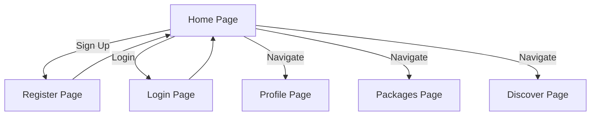
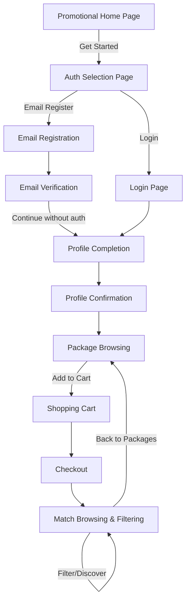
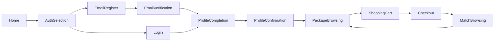

# Onboarding Flow Design Specification

## Current Flow Analysis

**Existing Pages:**
- [Home.tsx](frontend/src/pages/Home.tsx:1) - Promotional landing page with sign up/login buttons
- [Register.tsx](frontend/src/pages/Register.tsx:1) - Simple registration form (name, email, password)
- [Login.tsx](frontend/src/pages/Login.tsx:1) - Login form (email, password)
- [Profile.tsx](frontend/src/pages/Profile.tsx:1) - Profile management page
- [Packages.tsx](frontend/src/pages/Packages.tsx:1) - Package browsing page
- [Discover.tsx](frontend/src/pages/Discover.tsx:1) - Match discovery page

**Current Flow:**

**Limitations:**
- No email verification step
- No structured onboarding sequence
- No profile completion flow
- No shopping cart/checkout process
- No match filtering capabilities

## New Onboarding Flow Diagram

## Page Designs

### 1. Promotional Home Page
- **Purpose:** Attract users with clear value proposition
- **Key Elements:**
  - Hero section with tagline: "Date Nights That Invest in Your Community"
  - Three-column features grid
  - Stats section (10K+ dates, 500+ restaurants, 95% show-up rate, 4.8★ rating)
  - Clear CTA buttons: "Get Started" (primary) and "Learn More" (secondary)
  - Responsive design with mobile-first approach

### 2. Auth Selection Page
- **Purpose:** Let users choose login or register with email (other methods pending)
- **Key Elements:**
  - Email registration card (primary CTA)
  - Login card (secondary option)
  - "Other methods coming soon" section with social login buttons marked as "Pending"
  - Responsive grid layout (2 columns on desktop, 1 column on mobile)
  - Clear navigation between login/register

### 3. Email Registration Page
- **Purpose:** Collect basic user information for account creation
- **Key Elements:**
  - Email input field (with validation)
  - Password input field (with strength requirements)
  - Confirm password field (matching validation)
  - Terms of service and privacy policy checkboxes
  - "Create Account" button with loading state
  - "Already have an account? Login" link

### 4. Email Verification Page
- **Purpose:** Notify user to verify email with placeholder UI
- **Key Elements:**
  - Verification status message
  - Email sent notification with user's email address
  - "Resend Verification Email" button
  - "Continue without authentication" button (placeholder functionality)
  - Loading states for button interactions

### 5. Profile Completion Page
- **Purpose:** Collect detailed user information for profile creation
- **Key Elements:**
  - Profile photo upload (with preview)
  - Name field (editable)
  - Age field (number input, 18-100)
  - Bio textarea (max 500 characters)
  - Interests tags input (multiple selection)
  - Relationship goals dropdown
  - "Save & Continue" button with validation

### 6. Profile Confirmation Dialog
- **Purpose:** Allow user to review and confirm profile information
- **Key Elements:**
  - Modal dialog with dark overlay
  - Profile preview card
  - "Edit Profile" button to go back
  - "Confirm & Continue" button to proceed
  - Responsive modal sizing (full screen on mobile)

### 7. Package Browsing Page
- **Purpose:** Display available date night packages
- **Key Elements:**
  - Package cards grid (3 columns desktop, 1 column mobile)
  - Package details: name, price, duration, max participants
  - "Add to Cart" button on each package
  - Cart indicator with item count
  - Search and filter options (by cuisine, price range, duration)

### 8. Shopping Cart Page
- **Purpose:** Allow user to review and manage cart items
- **Key Elements:**
  - Cart items list with remove button
  - Subtotal, tax, and total price calculation
  - "Continue Shopping" button
  - "Proceed to Checkout" button
  - Empty cart state message

### 9. Checkout Page
- **Purpose:** Process package purchase
- **Key Elements:**
  - Order summary (items, quantities, prices)
  - Payment information form (credit card, billing address)
  - "Place Order" button with loading state
  - Order confirmation message after successful purchase

### 10. Match Browsing & Filtering Page
- **Purpose:** Display compatible matches with filtering options
- **Key Elements:**
  - Match cards with user photos, names, ages, bio snippets
  - Like/Dislike buttons on each card
  - Filter sidebar (age range, distance, interests, relationship goals)
  - Search functionality
  - Pagination or infinite scroll
  - Responsive design (sidebar becomes drawer on mobile)

## Mobile-First Responsive Design Guidelines

### Breakpoints:
- **Mobile (0-640px):** 100% width, vertical layouts
- **Tablet (641-1024px):** 2-column grids, responsive typography
- **Desktop (1025px+):** 3-4 column grids, full sidebar layouts

### Key Principles:
1. **Touch-friendly elements:** Buttons min 44px x 44px
2. **Responsive typography:** Use REM units, scale appropriately
3. **Progressive disclosure:** Hide non-essential elements on mobile
4. **Performance optimization:** Lazy load images, prioritize content
5. **Consistent spacing:** Use 8px grid system

### Component Adaptations:
- **Navigation:** Bottom tab bar on mobile, sidebar on desktop
- **Filters:** Drawer on mobile, sidebar on desktop
- **Cards:** Full width on mobile, grid on larger screens
- **Forms:** Stacked inputs on mobile, horizontal layouts on desktop

## Navigation Flow Between Pages

### Primary Navigation:

### Secondary Navigation:
- **Back buttons:** Available on all pages to return to previous step
- **Skip links:** On verification and profile completion pages
- **Footer links:** Terms of service, privacy policy, help center
- **Profile menu:** Accessible from any page after onboarding

### URL Structure:
- `/` - Promotional home page
- `/auth` - Auth selection page
- `/auth/register` - Email registration
- `/auth/login` - Login page
- `/auth/verify` - Email verification
- `/onboarding/profile` - Profile completion
- `/packages` - Package browsing
- `/cart` - Shopping cart
- `/checkout` - Checkout
- `/discover` - Match browsing & filtering

## Implementation Tasks

### Phase 1: Foundation
1. Update existing Home.tsx with new promotional design
2. Create AuthSelection.tsx component
3. Enhance Register.tsx with improved validation and UI
4. Create EmailVerification.tsx component

### Phase 2: Profile Completion
1. Create ProfileCompletion.tsx with comprehensive form
2. Create ProfileConfirmation.tsx modal component
3. Update Profile.tsx to display complete profile information

### Phase 3: Shopping Experience
1. Enhance Packages.tsx with cart functionality
2. Create ShoppingCart.tsx component
3. Create Checkout.tsx component

### Phase 4: Match Browsing
1. Enhance Discover.tsx with filtering and improved UI
2. Create FilterSidebar.tsx component
3. Implement search functionality

### Phase 5: Responsive Design
1. Implement mobile-first responsive layouts for all pages
2. Optimize for various screen sizes
3. Test across devices and browsers

## Technical Considerations

### State Management:
- Use context API or Redux for user state
- Local storage for cart and onboarding progress
- Session storage for verification tokens

### Form Handling:
- React Hook Form for form management
- Yup for validation
- Error handling and loading states

### API Integration:
- Authentication endpoints for register/login
- User profile endpoints
- Packages and cart endpoints
- Match discovery and filtering endpoints

### Performance:
- Code splitting for onboarding pages
- Image optimization with lazy loading
- Debouncing for search and filters

This design specification provides a comprehensive blueprint for implementing the new onboarding flow. Each page is designed with mobile-first principles and clear user navigation, ensuring a smooth and engaging experience from registration to match discovery.
