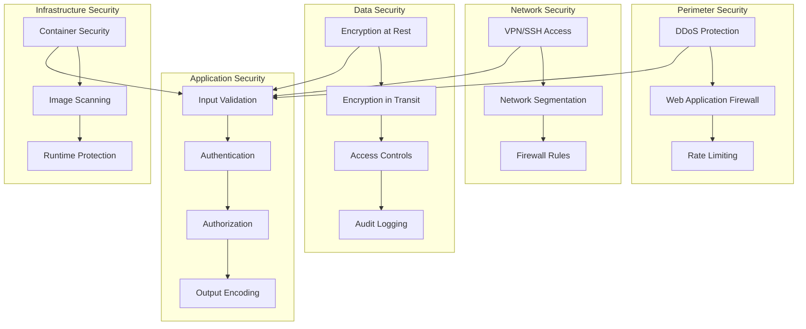

# Local Singles Date Night - Security & Compliance

**Version:** 1.0  
**Date:** January 6, 2025  
**Status:** Draft

## Table of Contents

1. [Security Overview](#1-security-overview)
2. [Authentication & Authorization](#2-authentication--authorization)
3. [Data Protection](#3-data-protection)
4. [API Security](#4-api-security)
5. [Compliance Requirements](#5-compliance-requirements)
6. [Security Monitoring](#6-security-monitoring)
7. [Incident Response](#7-incident-response)
8. [Security Testing](#8-security-testing)

---

## 1. Security Overview

### 1.1 Security Principles

The Local Singles Date Night application follows these core security principles:

- **Defense in Depth**: Multiple layers of security controls
- **Least Privilege**: Users and systems have minimal necessary permissions
- **Zero Trust**: Never trust, always verify
- **Security by Design**: Security considerations in all development phases
- **Privacy by Design**: Data protection built into system architecture

### 1.2 Threat Model

#### STRIDE Analysis

| Threat Category | Examples | Mitigation |
|----------------|----------|------------|
| **Spoofing** | Fake user profiles, impersonation | Email verification, ID verification, rate limiting |
| **Tampering** | Data modification in transit, API manipulation | HTTPS, input validation, data integrity checks |
| **Repudiation** | Users denying actions, lack of audit trails | Comprehensive logging, digital signatures |
| **Information Disclosure** | Data breaches, unauthorized access | Encryption, access controls, data minimization |
| **Denial of Service** | API flooding, resource exhaustion | Rate limiting, load balancing, CDN |
| **Elevation of Privilege** | Privilege escalation, admin access | Role-based access, principle of least privilege |

### 1.3 Security Architecture



---

## 2. Authentication & Authorization

### 2.1 Authentication Flow

#### JWT-Based Authentication
```typescript
// JWT Service Implementation
class JWTService {
  private readonly accessTokenExpiry = '15m';
  private readonly refreshTokenExpiry = '7d';
  private readonly algorithm = 'HS256';

  generateTokens(user: User): TokenPair {
    const payload = {
      userId: user.id,
      email: user.email,
      roles: user.roles,
      permissions: user.permissions,
      iat: Math.floor(Date.now() / 1000),
      iss: 'lsdn-api',
      aud: 'lsdn-client'
    };

    const accessToken = jwt.sign(payload, process.env.JWT_SECRET, {
      expiresIn: this.accessTokenExpiry,
      algorithm: this.algorithm
    });

    const refreshToken = jwt.sign(
      { userId: user.id, tokenVersion: user.tokenVersion },
      process.env.REFRESH_TOKEN_SECRET,
      { expiresIn: this.refreshTokenExpiry }
    );

    return { accessToken, refreshToken };
  }

  verifyAccessToken(token: string): JWTPayload {
    return jwt.verify(token, process.env.JWT_SECRET, {
      algorithms: [this.algorithm],
      issuer: 'lsdn-api',
      audience: 'lsdn-client'
    }) as JWTPayload;
  }
}
```

#### Multi-Factor Authentication
```typescript
// 2FA Implementation
class TwoFactorService {
  async generateTOTP(user: User): Promise<string> {
    const secret = authenticator.generateSecret();
    
    // Store encrypted secret
    const encryptedSecret = await this.encryptSecret(secret, user.id);
    await this.userRepository.update(user.id, {
      totpSecret: encryptedSecret,
      totpEnabled: false // Not enabled until verified
    });

    return secret;
  }

  async verifyTOTP(user: User, token: string): Promise<boolean> {
    const encryptedSecret = user.totpSecret;
    const secret = await this.decryptSecret(encryptedSecret, user.id);
    
    return authenticator.verify({
      token,
      secret
    });
  }

  async enableTOTP(user: User, token: string): Promise<void> {
    const isValid = await this.verifyTOTP(user, token);
    if (!isValid) {
      throw new AuthenticationError('Invalid TOTP token');
    }

    await this.userRepository.update(user.id, {
      totpEnabled: true
    });
  }
}
```

### 2.2 Authorization System

#### Role-Based Access Control (RBAC)
```typescript
// RBAC Implementation
enum UserRole {
  USER = 'user',
  PARTNER = 'partner',
  ADMIN = 'admin',
  SUPER_ADMIN = 'super_admin'
}

enum Permission {
  // User permissions
  READ_PROFILE = 'read:profile',
  UPDATE_PROFILE = 'update:profile',
  BOOK_RESTAURANT = 'book:restaurant',
  VIEW_MATCHES = 'view:matches',
  SEND_MESSAGES = 'send:messages',
  
  // Partner permissions
  MANAGE_MENU = 'manage:menu',
  VIEW_ANALYTICS = 'view:analytics',
  MANAGE_AVAILABILITY = 'manage:availability',
  
  // Admin permissions
  MANAGE_USERS = 'manage:users',
  MANAGE_RESTAURANTS = 'manage:restaurants',
  VIEW_REPORTS = 'view:reports',
  SYSTEM_CONFIG = 'system:config'
}

class AuthorizationService {
  private rolePermissions: Record<UserRole, Permission[]> = {
    [UserRole.USER]: [
      Permission.READ_PROFILE,
      Permission.UPDATE_PROFILE,
      Permission.BOOK_RESTAURANT,
      Permission.VIEW_MATCHES,
      Permission.SEND_MESSAGES
    ],
    [UserRole.PARTNER]: [
      Permission.READ_PROFILE,
      Permission.MANAGE_MENU,
      Permission.VIEW_ANALYTICS,
      Permission.MANAGE_AVAILABILITY
    ],
    [UserRole.ADMIN]: [
      Permission.MANAGE_USERS,
      Permission.MANAGE_RESTAURANTS,
      Permission.VIEW_REPORTS
    ],
    [UserRole.SUPER_ADMIN]: Object.values(Permission)
  };

  hasPermission(userRole: UserRole, permission: Permission): boolean {
    return this.rolePermissions[userRole].includes(permission);
  }

  hasAnyPermission(userRole: UserRole, permissions: Permission[]): boolean {
    return permissions.some(permission => 
      this.rolePermissions[userRole].includes(permission)
    );
  }
}
```

#### Middleware Implementation
```typescript
// Auth Middleware
const authMiddleware = (requiredPermissions: Permission[] = []) => {
  return async (req: Request, res: Response, next: NextFunction) => {
    try {
      const authHeader = req.headers.authorization;
      
      if (!authHeader || !authHeader.startsWith('Bearer ')) {
        return res.status(401).json({
          success: false,
          error: {
            code: 'AUTHENTICATION_ERROR',
            message: 'Authentication required'
          }
        });
      }

      const token = authHeader.substring(7);
      const payload = jwtService.verifyAccessToken(token);
      
      // Check if user still exists and is active
      const user = await userRepository.findById(payload.userId);
      if (!user || !user.isActive) {
        return res.status(401).json({
          success: false,
          error: {
            code: 'AUTHENTICATION_ERROR',
            message: 'User not found or inactive'
          }
        });
      }

      // Check permissions
      if (requiredPermissions.length > 0) {
        const hasPermission = requiredPermissions.every(permission =>
          user.permissions.includes(permission)
        );
        
        if (!hasPermission) {
          return res.status(403).json({
            success: false,
            error: {
              code: 'AUTHORIZATION_ERROR',
              message: 'Insufficient permissions'
            }
          });
        }
      }

      req.user = user;
      next();
    } catch (error) {
      if (error instanceof jwt.JsonWebTokenError) {
        return res.status(401).json({
          success: false,
          error: {
            code: 'AUTHENTICATION_ERROR',
            message: 'Invalid token'
          }
        });
      }
      
      if (error instanceof jwt.TokenExpiredError) {
        return res.status(401).json({
          success: false,
          error: {
            code: 'TOKEN_EXPIRED',
            message: 'Token has expired'
          }
        });
      }

      next(error);
    }
  };
};
```

---

## 3. Data Protection

### 3.1 Encryption Strategy

#### Data at Rest Encryption
```typescript
// Database Encryption Service
class DatabaseEncryptionService {
  private readonly algorithm = 'aes-256-gcm';
  private readonly key: Buffer;

  constructor() {
    this.key = Buffer.from(process.env.ENCRYPTION_KEY!, 'hex');
  }

  encrypt(text: string): EncryptedData {
    const iv = crypto.randomBytes(16);
    const cipher = crypto.createCipher(this.algorithm, this.key);
    cipher.setAAD(Buffer.from('lsdn', 'utf8'));
    
    let encrypted = cipher.update(text, 'utf8', 'hex');
    encrypted += cipher.final('hex');
    
    const authTag = cipher.getAuthTag();
    
    return {
      encrypted,
      iv: iv.toString('hex'),
      authTag: authTag.toString('hex')
    };
  }

  decrypt(encryptedData: EncryptedData): string {
    const decipher = crypto.createDecipher(this.algorithm, this.key);
    decipher.setAAD(Buffer.from('lsdn', 'utf8'));
    decipher.setAuthTag(Buffer.from(encryptedData.authTag, 'hex'));
    
    let decrypted = decipher.update(encryptedData.encrypted, 'hex', 'utf8');
    decrypted += decipher.final('utf8');
    
    return decrypted;
  }

  // Encrypt sensitive user data
  async encryptUserData(userData: Partial<User>): Promise<Partial<User>> {
    const encryptedData: Partial<User> = { ...userData };
    
    if (userData.bio) {
      encryptedData.bio = JSON.stringify(this.encrypt(userData.bio));
    }
    
    if (userData.interests) {
      encryptedData.interests = JSON.stringify(
        userData.interests.map(interest => this.encrypt(interest).encrypted)
      );
    }
    
    return encryptedData;
  }
}
```

#### Data in Transit Encryption
```typescript
// HTTPS Configuration
const httpsOptions = {
  key: fs.readFileSync('/path/to/private.key'),
  cert: fs.readFileSync('/path/to/certificate.crt'),
  ca: fs.readFileSync('/path/to/ca-bundle.crt'),
  // Security headers
  secureProtocol: 'TLSv1_2_method',
  ciphers: [
    'ECDHE-RSA-AES128-GCM-SHA256',
    'ECDHE-RSA-AES256-GCM-SHA384',
    'ECDHE-RSA-AES128-SHA256',
    'ECDHE-RSA-AES256-SHA384'
  ].join(':'),
  honorCipherOrder: false
};

// Security Headers Middleware
const securityHeaders = (req: Request, res: Response, next: NextFunction) => {
  res.setHeader('X-Content-Type-Options', 'nosniff');
  res.setHeader('X-Frame-Options', 'DENY');
  res.setHeader('X-XSS-Protection', '1; mode=block');
  res.setHeader('Strict-Transport-Security', 'max-age=31536000; includeSubDomains');
  res.setHeader('Content-Security-Policy', "default-src 'self'");
  res.setHeader('Referrer-Policy', 'strict-origin-when-cross-origin');
  next();
};
```

### 3.2 Data Minimization

#### PII Handling
```typescript
// Data Minimization Service
class DataMinimizationService {
  // Remove sensitive data from responses
  sanitizeUser(user: User): SanitizedUser {
    const {
      passwordHash,
      totpSecret,
      verificationToken,
      deletedAt,
      ...sanitizedUser
    } = user;
    
    return sanitizedUser;
  }

  // Anonymize data for analytics
  anonymizeUserData(user: User): AnonymizedUser {
    return {
      id: this.hashUserId(user.id),
      age: this.getAgeRange(user.dateOfBirth),
      location: this.getCityLevelLocation(user.location),
      interests: user.interests,
      createdAt: user.createdAt
    };
  }

  private hashUserId(userId: string): string {
    return crypto
      .createHash('sha256')
      .update(userId + process.env.HASH_SALT)
      .digest('hex')
      .substring(0, 16);
  }

  private getAgeRange(dateOfBirth: Date): string {
    const age = this.calculateAge(dateOfBirth);
    if (age < 25) return '18-24';
    if (age < 35) return '25-34';
    if (age < 45) return '35-44';
    if (age < 55) return '45-54';
    return '55+';
  }

  private getCityLevelLocation(location: Point): string {
    // Return only city-level location for privacy
    return `${location.latitude.toFixed(2)},${location.longitude.toFixed(2)}`;
  }
}
```

### 3.3 Data Retention & Deletion

#### Data Lifecycle Management
```typescript
// Data Retention Service
class DataRetentionService {
  async cleanupExpiredData(): Promise<void> {
    const now = new Date();
    
    // Delete expired matching requests
    await MatchingRequest.delete({
      expiresAt: LessThan(now)
    });

    // Delete old messages (keep for 2 years)
    const twoYearsAgo = new Date(now.getFullYear() - 2, now.getMonth(), now.getDate());
    await Message.delete({
      createdAt: LessThan(twoYearsAgo)
    });

    // Archive old bookings (keep for 7 years for tax purposes)
    const sevenYearsAgo = new Date(now.getFullYear() - 7, now.getMonth(), now.getDate());
    await Booking.update(
      { createdAt: LessThan(sevenYearsAgo) },
      { status: 'archived' }
    );

    // Delete unverified accounts after 30 days
    const thirtyDaysAgo = new Date(now.getTime() - 30 * 24 * 60 * 60 * 1000);
    await User.delete({
      verifiedAt: IsNull(),
      createdAt: LessThan(thirtyDaysAgo)
    });
  }

  async anonymizeUserData(userId: string): Promise<void> {
    await User.update(userId, {
      email: `deleted_${Date.now()}@anonymized.com`,
      firstName: 'Deleted',
      lastName: 'User',
      bio: null,
      profilePhotoUrl: null,
      profilePhotos: null,
      location: null,
      interests: null,
      languages: null,
      dietaryRestrictions: null,
      deletedAt: new Date()
    });
  }

  async deleteUserAccount(userId: string): Promise<void> {
    // Anonymize user data
    await this.anonymizeUserData(userId);
    
    // Delete related data
    await UserPackage.delete({ userId });
    await MatchingRequest.delete({ userId });
    await Message.delete({ senderId: userId });
    await Message.delete({ receiverId: userId });
    
    // Log deletion for audit
    await AuditLog.create({
      action: 'USER_DELETION',
      userId,
      timestamp: new Date(),
      details: { reason: 'User requested account deletion' }
    });
  }
}
```

---

## 4. API Security

### 4.1 Input Validation & Sanitization

#### Request Validation
```typescript
// Input Validation Service
class ValidationService {
  // Zod schemas for validation
  private schemas = {
    register: z.object({
      email: z.string().email('Invalid email format'),
      password: z.string()
        .min(8, 'Password must be at least 8 characters')
        .regex(/^(?=.*[a-z])(?=.*[A-Z])(?=.*\d)/, 'Password must contain uppercase, lowercase, and number'),
      firstName: z.string().min(2, 'First name must be at least 2 characters'),
      lastName: z.string().min(2, 'Last name must be at least 2 characters'),
      dateOfBirth: z.string().refine((date) => {
        const age = this.calculateAge(new Date(date));
        return age >= 18 && age <= 100;
      }, 'User must be between 18 and 100 years old'),
      location: z.object({
        latitude: z.number().min(-90).max(90),
        longitude: z.number().min(-180).max(180)
      })
    }),

    booking: z.object({
      userAId: z.string().uuid('Invalid user ID'),
      userBId: z.string().uuid('Invalid user ID'),
      restaurantId: z.string().uuid('Invalid restaurant ID'),
      packageId: z.string().uuid('Invalid package ID'),
      slotId: z.string().uuid('Invalid slot ID'),
      bookingTime: z.string().datetime('Invalid datetime format'),
      preferredTimeStart: z.string().datetime('Invalid start time'),
      preferredTimeEnd: z.string().datetime('Invalid end time'),
      maxDistance: z.number().min(1).max(100, 'Distance must be between 1 and 100 miles')
    })
  };

  validate<T>(schemaName: keyof typeof this.schemas, data: any): T {
    const schema = this.schemas[schemaName];
    return schema.parse(data);
  }

  sanitizeInput(input: string): string {
    return DOMPurify.sanitize(input, {
      ALLOWED_TAGS: [],
      ALLOWED_ATTR: []
    });
  }
}
```

#### SQL Injection Prevention
```typescript
// Database Query Service with ORM
class DatabaseService {
  // TypeORM automatically handles SQL injection prevention
  async findUsersByLocation(location: Point, radius: number): Promise<User[]> {
    return await this.userRepository
      .createQueryBuilder('user')
      .where('ST_DWithin(user.location, ST_Point(:lat, :lng), :radius)', {
        lat: location.latitude,
        lng: location.longitude,
        radius: radius * 1609.34 // Convert miles to meters
      })
      .getMany();
  }

  // Parameterized queries for raw SQL
  async executeQuery(query: string, parameters: any[]): Promise<any> {
    return await this.entityManager.query(query, parameters);
  }
}
```

### 4.2 Rate Limiting

#### API Rate Limiting
```typescript
// Rate Limiting Service
class RateLimitService {
  private redis: Redis;
  private limits = {
    auth: { windowMs: 15 * 60 * 1000, max: 5 }, // 5 attempts per 15 minutes
    user: { windowMs: 60 * 60 * 1000, max: 100 }, // 100 requests per hour
    booking: { windowMs: 60 * 60 * 1000, max: 20 }, // 20 booking operations per hour
    messaging: { windowMs: 60 * 1000, max: 50 } // 50 messages per minute
  };

  async checkRateLimit(key: string, type: keyof typeof this.limits): Promise<boolean> {
    const limit = this.limits[type];
    const now = Date.now();
    const windowStart = now - limit.windowMs;
    
    // Remove old entries
    await this.redis.zremrangebyscore(key, 0, windowStart);
    
    // Count current requests
    const currentRequests = await this.redis.zcard(key);
    
    if (currentRequests >= limit.max) {
      return false;
    }
    
    // Add current request
    await this.redis.zadd(key, now, `${now}-${Math.random()}`);
    await this.redis.expire(key, Math.ceil(limit.windowMs / 1000));
    
    return true;
  }

  // Express middleware
  createMiddleware(type: keyof typeof this.limits) {
    return async (req: Request, res: Response, next: NextFunction) => {
      const key = `${type}:${req.ip}:${req.user?.id || 'anonymous'}`;
      
      const allowed = await this.checkRateLimit(key, type);
      
      if (!allowed) {
        return res.status(429).json({
          success: false,
          error: {
            code: 'RATE_LIMIT_EXCEEDED',
            message: 'Too many requests. Please try again later.'
          }
        });
      }
      
      next();
    };
  }
}
```

### 4.3 CORS & Security Headers

#### CORS Configuration
```typescript
// CORS Configuration
const corsOptions = {
  origin: (origin: string | undefined, callback: (err: Error | null, allow?: boolean) => void) => {
    const allowedOrigins = process.env.ALLOWED_ORIGINS?.split(',') || [];
    
    // Allow requests with no origin (like mobile apps or curl requests)
    if (!origin) return callback(null, true);
    
    if (allowedOrigins.includes(origin)) {
      callback(null, true);
    } else {
      callback(new Error('Not allowed by CORS'));
    }
  },
  credentials: true,
  methods: ['GET', 'POST', 'PUT', 'DELETE', 'OPTIONS'],
  allowedHeaders: ['Content-Type', 'Authorization', 'X-Requested-With'],
  exposedHeaders: ['X-RateLimit-Limit', 'X-RateLimit-Remaining', 'X-RateLimit-Reset']
};

// Apply CORS middleware
app.use(cors(corsOptions));
```

---

## 5. Compliance Requirements

### 5.1 GDPR Compliance

#### Data Subject Rights
```typescript
// GDPR Compliance Service
class GDPRService {
  // Right to Access
  async exportUserData(userId: string): Promise<UserDataExport> {
    const user = await this.userRepository.findById(userId);
    const packages = await this.userPackageRepository.findByUserId(userId);
    const bookings = await this.bookingRepository.findByUserId(userId);
    const messages = await this.messageRepository.findByUserId(userId);
    
    return {
      user: this.sanitizeUser(user),
      packages,
      bookings,
      messages,
      exportDate: new Date(),
      format: 'json'
    };
  }

  // Right to Erasure
  async handleErasureRequest(userId: string, reason: string): Promise<void> {
    // Log request for compliance
    await this.auditLogService.create({
      action: 'GDPR_ERASURE_REQUEST',
      userId,
      details: { reason }
    });

    // Anonymize user data
    await this.dataRetentionService.anonymizeUserData(userId);
    
    // Notify user of completion
    await this.emailService.sendErasureConfirmation(userId);
  }

  // Data Processing Agreement
  async generateDPA(): Promise<string> {
    return `
      DATA PROCESSING AGREEMENT
      ========================
      
      This Data Processing Agreement ("DPA") forms part of the terms of service 
      between Local Singles Date Night ("Processor") and its users ("Controller").
      
      1. DATA PROCESSING
         The Processor processes personal data for the purpose of providing 
         dating services, including user matching, booking management, and 
         communication services.
      
      2. DATA SUBJECTS
         The data subjects are users of the Local Singles Date Night platform.
      
      3. DATA CATEGORIES
         Personal identification data, contact information, location data, 
         preferences, and communication data.
      
      4. COMPLIANCE
         The Processor shall comply with all applicable data protection laws 
         and regulations, including GDPR.
    `;
  }
}
```

#### Privacy Policy Implementation
```typescript
// Privacy Policy Service
class PrivacyPolicyService {
  async getPrivacyPolicy(): Promise<PrivacyPolicy> {
    return {
      version: '1.0',
      lastUpdated: '2024-01-01',
      sections: [
        {
          title: 'Information We Collect',
          content: 'We collect personal information including name, email, location, and preferences to provide our dating services.'
        },
        {
          title: 'How We Use Your Information',
          content: 'We use your information to create matches, manage bookings, send notifications, and improve our services.'
        },
        {
          title: 'Data Sharing',
          content: 'We share information with restaurant partners for booking purposes and with service providers for operational support.'
        },
        {
          title: 'Your Rights',
          content: 'You have the right to access, correct, delete, or restrict processing of your personal data.'
        }
      ]
    };
  }

  async logConsent(userId: string, consentType: string): Promise<void> {
    await this.consentLogRepository.create({
      userId,
      consentType,
      grantedAt: new Date(),
      ipAddress: getCurrentIpAddress()
    });
  }
}
```

### 5.2 PCI DSS Compliance

#### Payment Card Industry Compliance
```typescript
// PCI DSS Compliance Service
class PCIDSSService {
  // Tokenization for payment data
  async tokenizePaymentData(paymentData: PaymentData): Promise<PaymentToken> {
    // Never store sensitive payment data
    const token = await this.stripeService.createPaymentMethod(paymentData);
    
    // Log tokenization for audit
    await this.auditLogService.create({
      action: 'PAYMENT_TOKENIZATION',
      details: {
        token: token.id,
        last4: paymentData.card.last4,
        brand: paymentData.card.brand
      }
    });

    return {
      tokenId: token.id,
      last4: paymentData.card.last4,
      brand: paymentData.card.brand,
      expMonth: paymentData.card.expMonth,
      expYear: paymentData.card.expYear
    };
  }

  // Secure payment processing
  async processPayment(paymentRequest: PaymentRequest): Promise<PaymentResult> {
    try {
      // Validate payment request
      this.validatePaymentRequest(paymentRequest);
      
      // Process payment through Stripe
      const result = await this.stripeService.chargeCustomer({
        amount: paymentRequest.amount,
        currency: paymentRequest.currency,
        description: paymentRequest.description,
        paymentMethodId: paymentRequest.paymentMethodId
      });

      // Log successful transaction
      await this.auditLogService.create({
        action: 'PAYMENT_PROCESSED',
        details: {
          amount: paymentRequest.amount,
          currency: paymentRequest.currency,
          transactionId: result.id
        }
      });

      return {
        success: true,
        transactionId: result.id,
        amount: result.amount,
        currency: result.currency
      };
    } catch (error) {
      // Log failed transaction
      await this.auditLogService.create({
        action: 'PAYMENT_FAILED',
        details: {
          amount: paymentRequest.amount,
          currency: paymentRequest.currency,
          error: error.message
        }
      });

      throw error;
    }
  }
}
```

### 5.3 SOC 2 Compliance

#### SOC 2 Controls Implementation
```typescript
// SOC 2 Compliance Service
class SOC2Service {
  // Security Control: Access Management
  async implementAccessControls(): Promise<void> {
    // Implement least privilege access
    await this.roleBasedAccessControl.initialize();
    
    // Implement MFA for all administrative access
    await this.mfaService.enableForAllAdmins();
    
    // Implement session management
    await this.sessionManager.configure({
      timeout: 30 * 60 * 1000, // 30 minutes
      maxConcurrentSessions: 3
    });
  }

  // Security Control: Change Management
  async implementChangeManagement(): Promise<void> {
    // Code review requirements
    await this.codeReviewService.configure({
      requiredApprovers: 2,
      automatedTesting: true,
      securityScanning: true
    });

    // Deployment controls
    await this.deploymentService.configure({
      stagingEnvironmentRequired: true,
      rollbackProcedures: true,
      approvalWorkflow: true
    });
  }

  // Security Control: Monitoring
  async implementMonitoring(): Promise<void> {
    // Real-time monitoring
    await this.monitoringService.configure({
      securityEvents: true,
      performanceMetrics: true,
      anomalyDetection: true
    });

    // Audit logging
    await this.auditLogService.configure({
      immutableLogs: true,
      realTimeAlerts: true,
      retentionPeriod: '7 years'
    });
  }
}
```

---

## 6. Security Monitoring

### 6.1 Security Information and Event Management (SIEM)

#### Security Monitoring Service
```typescript
// SIEM Integration
class SecurityMonitoringService {
  private logger: Logger;
  private alertManager: AlertManager;

  constructor() {
    this.logger = winston.createLogger({
      level: 'info',
      format: winston.format.combine(
        winston.format.timestamp(),
        winston.format.errors({ stack: true }),
        winston.format.json()
      ),
      transports: [
        new winston.transports.File({ filename: 'security.log' }),
        new winston.transports.Console()
      ]
    });
  }

  async logSecurityEvent(event: SecurityEvent): Promise<void> {
    this.logger.warn('Security Event', {
      timestamp: new Date().toISOString(),
      event: event.type,
      severity: event.severity,
      source: event.source,
      details: event.details,
      userId: event.userId,
      ipAddress: event.ipAddress
    });

    // Trigger alerts for high-severity events
    if (event.severity === 'high' || event.severity === 'critical') {
      await this.alertManager.sendAlert(event);
    }
  }

  // Monitor for suspicious activities
  async monitorSuspiciousActivity(): Promise<void> {
    // Failed login attempts
    const failedLogins = await this.getFailedLoginAttempts();
    if (failedLogins > 5) {
      await this.logSecurityEvent({
        type: 'MULTIPLE_FAILED_LOGINS',
        severity: 'medium',
        source: 'AUTH_SERVICE',
        details: { attempts: failedLogins },
        userId: null,
        ipAddress: getCurrentIpAddress()
      });
    }

    // Unusual location access
    const unusualLocations = await this.detectUnusualLocations();
    for (const location of unusualLocations) {
      await this.logSecurityEvent({
        type: 'UNUSUAL_LOCATION_ACCESS',
        severity: 'high',
        source: 'AUTH_SERVICE',
        details: location,
        userId: location.userId,
        ipAddress: location.ipAddress
      });
    }
  }
}
```

### 6.2 Vulnerability Scanning

#### Security Scanning Service
```typescript
// Vulnerability Scanning
class VulnerabilityScanningService {
  async scanApplication(): Promise<VulnerabilityReport> {
    const report: VulnerabilityReport = {
      timestamp: new Date(),
      vulnerabilities: [],
      recommendations: []
    };

    // Dependency scanning
    const dependencyVulnerabilities = await this.scanDependencies();
    report.vulnerabilities.push(...dependencyVulnerabilities);

    // Code scanning
    const codeVulnerabilities = await this.scanCode();
    report.vulnerabilities.push(...codeVulnerabilities);

    // Configuration scanning
    const configVulnerabilities = await this.scanConfiguration();
    report.vulnerabilities.push(...configVulnerabilities);

    // Generate recommendations
    report.recommendations = this.generateRecommendations(report.vulnerabilities);

    return report;
  }

  private async scanDependencies(): Promise<Vulnerability[]> {
    // Use Snyk or similar for dependency scanning
    const result = await exec('npm audit --json');
    const audit = JSON.parse(result.stdout);
    
    return audit.vulnerabilities ? Object.values(audit.vulnerabilities).map(vuln => ({
      id: vuln.id,
      severity: vuln.severity,
      title: vuln.title,
      description: vuln.overview,
      package: vuln.packageName,
      version: vuln.version,
      patchedVersions: vuln.patchedVersions
    })) : [];
  }

  private async scanCode(): Promise<Vulnerability[]> {
    // Use ESLint security plugin or similar
    const result = await exec('eslint --ext .ts,.js src/ --format json');
    const eslintResults = JSON.parse(result.stdout);
    
    return eslintResults.flatMap(file => 
      file.messages.map(message => ({
        id: message.ruleId,
        severity: message.severity === 2 ? 'high' : 'medium',
        title: message.ruleId,
        description: message.message,
        file: file.filePath,
        line: message.line
      }))
    );
  }
}
```

---

## 7. Incident Response

### 7.1 Incident Response Plan

#### Incident Response Service
```typescript
// Incident Response Service
class IncidentResponseService {
  private incidentLog: IncidentLog[] = [];

  async handleSecurityIncident(incident: SecurityIncident): Promise<IncidentResponse> {
    // 1. Immediate Response
    await this.immediateResponse(incident);
    
    // 2. Investigation
    const investigation = await this.investigateIncident(incident);
    
    // 3. Containment
    await this.containIncident(incident);
    
    // 4. Recovery
    await this.recoverFromIncident(incident);
    
    // 5. Post-Incident Review
    await this.postIncidentReview(incident);

    return {
      incidentId: incident.id,
      status: 'RESOLVED',
      resolutionTime: new Date(),
      lessonsLearned: this.generateLessonsLearned(incident)
    };
  }

  private async immediateResponse(incident: SecurityIncident): Promise<void> {
    // Log incident
    this.incidentLog.push({
      id: incident.id,
      type: incident.type,
      severity: incident.severity,
      reportedAt: new Date(),
      status: 'IN_PROGRESS'
    });

    // Notify security team
    await this.notificationService.sendIncidentAlert(incident);

    // Assess impact
    const impact = await this.assessImpact(incident);
    await this.logSecurityEvent({
      type: 'INCIDENT_DETECTED',
      severity: 'critical',
      source: 'SECURITY_TEAM',
      details: { incidentId: incident.id, impact }
    });
  }

  private async containIncident(incident: SecurityIncident): Promise<void> {
    switch (incident.type) {
      case 'DATA_BREACH':
        await this.containDataBreach(incident);
        break;
      case 'DDOS_ATTACK':
        await this.mitigateDDoS(incident);
        break;
      case 'MALWARE_INFECTION':
        await this.isolateInfectedSystems(incident);
        break;
    }
  }

  private async containDataBreach(incident: SecurityIncident): Promise<void> {
    // Disable compromised accounts
    if (incident.affectedAccounts) {
      for (const accountId of incident.affectedAccounts) {
        await this.userRepository.update(accountId, { isActive: false });
      }
    }

    // Change system credentials
    await this.credentialService.rotateCredentials();

    // Notify affected users
    if (incident.severity === 'high' || incident.severity === 'critical') {
      await this.notificationService.notifyAffectedUsers(incident);
    }
  }
}
```

### 7.2 Data Breach Response

#### Data Breach Protocol
```typescript
// Data Breach Response
class DataBreachResponseService {
  async handleDataBreach(breach: DataBreach): Promise<void> {
    // 1. Assess scope
    const scope = await this.assessBreachScope(breach);
    
    // 2. Notify authorities (within 72 hours for GDPR)
    if (breach.requiresNotification) {
      await this.notifyAuthorities(breach, scope);
    }
    
    // 3. Notify affected users
    await this.notifyAffectedUsers(breach, scope);
    
    // 4. Implement remediation
    await this.implementRemediation(breach);
    
    // 5. Monitor for further issues
    await this.monitorForFurtherIssues(breach);
  }

  private async notifyAuthorities(breach: DataBreach, scope: BreachScope): Promise<void> {
    const notification = {
      breachDate: breach.discoveredAt,
      notificationDate: new Date(),
      affectedRecords: scope.affectedRecords,
      dataTypes: scope.dataTypes,
      description: breach.description,
      remediationSteps: breach.remediationSteps
    };

    // Notify relevant authorities based on jurisdiction
    if (scope.jurisdiction === 'EU') {
      await this.gdprNotifier.notifyEUAuthorities(notification);
    }
    
    if (scope.jurisdiction === 'US') {
      await this.usNotifier.notifyStateAuthorities(notification);
    }
  }

  private async notifyAffectedUsers(breach: DataBreach, scope: BreachScope): Promise<void> {
    for (const affectedUser of scope.affectedUsers) {
      await this.emailService.sendBreachNotification(affectedUser, {
        breachDate: breach.discoveredAt,
        dataInvolved: scope.dataTypes,
        stepsTaken: breach.remediationSteps,
        userProtectionSteps: this.getUserProtectionSteps(scope.dataTypes),
        contactInformation: this.getContactInformation()
      });
    }
  }
}
```

---

## 8. Security Testing

### 8.1 Security Testing Strategy

#### Security Testing Framework
```typescript
// Security Testing Service
class SecurityTestingService {
  // Unit tests for security functions
  async testAuthenticationSecurity(): Promise<void> {
    describe('Authentication Security', () => {
      it('should reject weak passwords', async () => {
        const weakPasswords = ['123456', 'password', 'abc123'];
        
        for (const password of weakPasswords) {
          await expect(authService.register({
            ...validUserData,
            password
          })).rejects.toThrow('Password does not meet security requirements');
        }
      });

      it('should enforce rate limiting on login attempts', async () => {
        const loginAttempts = Array(6).fill(null).map(() => 
          authService.login({ email: 'test@example.com', password: 'wrong' })
        );

        await Promise.all(loginAttempts);
        
        // 7th attempt should be rate limited
        await expect(authService.login({
          email: 'test@example.com',
          password: 'wrong'
        })).rejects.toThrow('Rate limit exceeded');
      });
    });
  }

  // Integration tests for API security
  async testAPISecurity(): Promise<void> {
    describe('API Security', () => {
      it('should reject requests without authentication', async () => {
        const response = await request(app)
          .get('/api/v1/users/profile')
          .expect(401);
      });

      it('should validate input parameters', async () => {
        const response = await request(app)
          .post('/api/v1/bookings/match')
          .set('Authorization', `Bearer ${validToken}`)
          .send({
            preferredTimeStart: 'invalid-date',
            maxDistance: -1
          })
          .expect(400);
      });

      it('should prevent SQL injection', async () => {
        const maliciousInput = "'; DROP TABLE users; --";
        
        const response = await request(app)
          .get(`/api/v1/users/${maliciousInput}`)
          .set('Authorization', `Bearer ${validToken}`)
          .expect(400);
      });
    });
  }

  // Penetration testing
  async runPenetrationTests(): Promise<PenetrationTestReport> {
    const report: PenetrationTestReport = {
      timestamp: new Date(),
      tests: [],
      vulnerabilities: [],
      recommendations: []
    };

    // Test authentication bypass
    const authBypassTest = await this.testAuthenticationBypass();
    report.tests.push(authBypassTest);

    // Test authorization bypass
    const authzBypassTest = await this.testAuthorizationBypass();
    report.tests.push(authzBypassTest);

    // Test injection attacks
    const injectionTest = await this.testInjectionAttacks();
    report.tests.push(injectionTest);

    // Test XSS vulnerabilities
    const xssTest = await this.testXSSVulnerabilities();
    report.tests.push(xssTest);

    return report;
  }

  private async testAuthenticationBypass(): Promise<SecurityTest> {
    // Test JWT token manipulation
    const manipulatedToken = this.manipulateJWT(validToken);
    const response = await request(app)
      .get('/api/v1/users/profile')
      .set('Authorization', `Bearer ${manipulatedToken}`);
    
    return {
      name: 'Authentication Bypass Test',
      passed: response.status === 401,
      details: response.status === 401 ? 'Token manipulation properly rejected' : 'Token manipulation succeeded'
    };
  }
}
```

### 8.2 Security Code Review

#### Security Code Review Checklist
```typescript
// Security Code Review Service
class SecurityCodeReviewService {
  async reviewCodeForSecurityIssues(code: string, filePath: string): Promise<SecurityReview> {
    const review: SecurityReview = {
      filePath,
      issues: [],
      recommendations: []
    };

    // Check for hardcoded secrets
    const hardcodedSecrets = this.findHardcodedSecrets(code);
    review.issues.push(...hardcodedSecrets);

    // Check for SQL injection vulnerabilities
    const sqlInjectionIssues = this.findSQLInjectionIssues(code);
    review.issues.push(...sqlInjectionIssues);

    // Check for XSS vulnerabilities
    const xssIssues = this.findXSSIssues(code);
    review.issues.push(...xssIssues);

    // Check for insecure cryptographic practices
    const cryptoIssues = this.findCryptoIssues(code);
    review.issues.push(...cryptoIssues);

    return review;
  }

  private findHardcodedSecrets(code: string): SecurityIssue[] {
    const issues: SecurityIssue[] = [];
    const secretPatterns = [
      /password\s*=\s*['"][^'"]+['"]/i,
      /api[_-]?key\s*=\s*['"][^'"]+['"]/i,
      /secret\s*=\s*['"][^'"]+['"]/i,
      /token\s*=\s*['"][^'"]+['"]/i
    ];

    for (const pattern of secretPatterns) {
      const matches = code.match(pattern);
      if (matches) {
        issues.push({
          type: 'HARDCODED_SECRET',
          severity: 'high',
          line: this.getLineNumber(code, matches.index!),
          description: 'Hardcoded secret detected',
          recommendation: 'Use environment variables or secure configuration management'
        });
      }
    }

    return issues;
  }

  private findSQLInjectionIssues(code: string): SecurityIssue[] {
    const issues: SecurityIssue[] = [];
    
    // Look for direct SQL query construction
    const sqlPatterns = [
      /query\s*=\s*`[^`]*\$\{.*\}/,
      /query\s*=\s*['"][^'"]*\+.*\+/,
      /\.query\([^)]*\+/
    ];

    for (const pattern of sqlPatterns) {
      const matches = code.match(pattern);
      if (matches) {
        issues.push({
          type: 'SQL_INJECTION',
          severity: 'high',
          line: this.getLineNumber(code, matches.index!),
          description: 'Potential SQL injection vulnerability',
          recommendation: 'Use parameterized queries or ORM'
        });
      }
    }

    return issues;
  }
}
```

This comprehensive security and compliance document provides detailed implementation guidance for securing the Local Singles Date Night application across all layers, from authentication and authorization to data protection, compliance, monitoring, and incident response. The security measures align with industry best practices and regulatory requirements including GDPR, PCI DSS, and SOC 2.